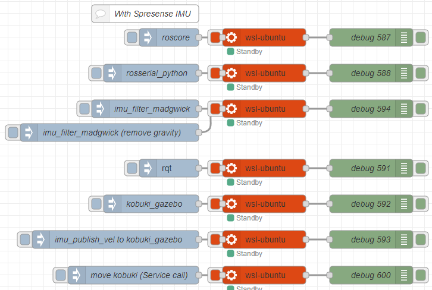

# Node-RED Integration for Spresense IMU

This folder contains Node-RED flows and resources for integrating the Spresense IMU data with Node-RED dashboards and processing pipelines.

## Overview

Node-RED provides a browser-based flow editor that makes it easy to wire together devices, APIs, and online services using a visual interface. In this project, it's used to visualize and process the IMU data from the Spresense board.

## Prerequisites

- Node-RED installed (v3.0.0 or higher recommended)
- WSL Ubuntu 20.04 with ROS Noetic
- `node-red-contrib-wsl-ubuntu` module installed in your Node-RED environment

## Installation

1. Install Node-RED if you haven't already:
   ```
   npm install -g node-red
   ```

2. Install the required WSL-Ubuntu node for Node-RED:
   ```
   cd ~/.node-red
   npm install node-red-contrib-wsl-ubuntu
   ```

3. Start Node-RED:
   ```
   node-red
   ```

4. Access the Node-RED editor at `http://localhost:1880`

## Included Resources

- `flows/wsl-ubuntu.json` - Example flow showing WSL-Ubuntu integration with ROS Noetic
- `images/wsl-ubuntu.png` - Screenshot showing the flow in action



## Setup Instructions

1. Import the provided flow file (`flows/wsl-ubuntu.json`) into your Node-RED instance
2. Configure the WSL nodes to point to your WSL Ubuntu distribution
3. Ensure ROS Noetic packages are installed in your WSL environment
4. Deploy the flow and access any associated dashboards

## Notes

- This integration requires ROS Noetic packages to be properly installed in your WSL Ubuntu 20.04 environment
- The WSL-Ubuntu node allows executing commands directly in the WSL environment, making it possible to interact with ROS from Node-RED
- For best performance, ensure your Windows system has adequate resources allocated to WSL
