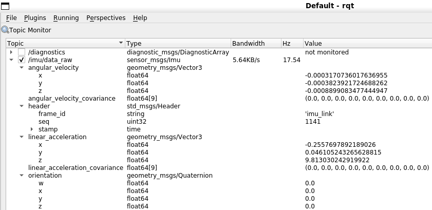

# ROS Integration for Spresense IMU

This folder contains resources and examples for integrating the Sony Spresense Multi-IMU Add-on Board with Robot Operating System (ROS).

## Overview

The Spresense IMU board can be used with ROS to provide inertial measurement data for robot navigation, sensor fusion, and other robotics applications. This integration allows you to use the high-quality IMU data from the Spresense within your ROS ecosystem.

## USB Connection Setup for WSL

When using ROS in a WSL (Windows Subsystem for Linux) environment, you need to configure USB device connections to allow WSL to access the Spresense board connected to Windows. Follow these steps:

1. **Install usbipd on Windows**
   - Download the MSI installer from: https://github.com/dorssel/usbipd-win/releases/tag/v4.2.0
   - Run the installer with administrator privileges

2. **Install required packages in WSL Ubuntu**
   ```bash
   sudo apt update
   sudo apt install linux-tools-generic hwdata
   sudo update-alternatives --install /usr/local/bin/usbip usbip /usr/lib/linux-tools/*/usbip 20
   ```

3. **List available USB devices on Windows**
   - Open Windows PowerShell as Administrator
   - Run the following command:
     ```powershell
     usbipd list
     ```
   - Note the BUSID of your Spresense device (it will appear as a serial device)

4. **Bind the USB device to usbipd**
   ```powershell
   usbipd bind --busid <busid>
   ```

5. **Attach the USB device to WSL**
   ```powershell
   usbipd attach --wsl --busid <busid>
   ```

6. **Verify the connection in WSL**
   - In your WSL Ubuntu terminal, run:
     ```bash
     lsusb
     ```
   - You should see your Spresense device listed

7. **Check the device node**
   ```bash
   ls -la /dev/ttyACM*
   ```
   - Your Spresense board should appear as `/dev/ttyACM0` or similar

## Using Spresense IMU with ROS

Once the USB connection is established, you can use the Spresense_IMU_ROS sketch to publish IMU data to ROS topics. The data will be published as standard `sensor_msgs/Imu` messages.

## Using rosserial with Spresense

The repository includes support for rosserial which provides an easy way to connect Arduino-compatible boards to ROS. This allows the Spresense to communicate directly with ROS over a serial connection.

### Prerequisites

Install the necessary ROS packages:

```bash
sudo apt install ros-noetic-rosserial-python
sudo apt install ros-noetic-rosserial-arduino
```

### Running rosserial

1. Upload the Spresense_IMU_ROS sketch to your Spresense board.

2. Connect the Spresense to your computer.

3. Run the rosserial node:
   ```bash
   rosrun rosserial_python serial_node.py _port:=/dev/ttyUSB0 _baud:=57600
   ```
   
   Note: Adjust the port name if necessary (e.g., `/dev/ttyACM0` instead of `/dev/ttyUSB0`).

4. The IMU data will now be published to the ROS topic `/imu/data_raw` as `sensor_msgs/Imu` messages.

## Visualizing IMU Data with rqt

After running rosserial_python, you can easily check the IMU sensor values using rqt:

```bash
rqt
```

In rqt, use the Plot plugin (Plugins > Visualization > Plot) to monitor the IMU data in real-time.



## Troubleshooting

- **USB device not showing up**: If the USB device isn't showing up after attachment, try detaching and reattaching:
  ```powershell
  usbipd detach --busid <busid>
  usbipd attach --wsl --busid <busid>
  ```

- **Permission denied**: If you get a permission error when accessing the serial port, add your user to the dialout group:
  ```bash
  sudo usermod -a -G dialout $USER
  ```
  Then log out and back in for the changes to take effect.

- **Auto-attach USB devices**: To automatically attach USB devices when WSL starts, you can add a script to your `.bashrc` file.
